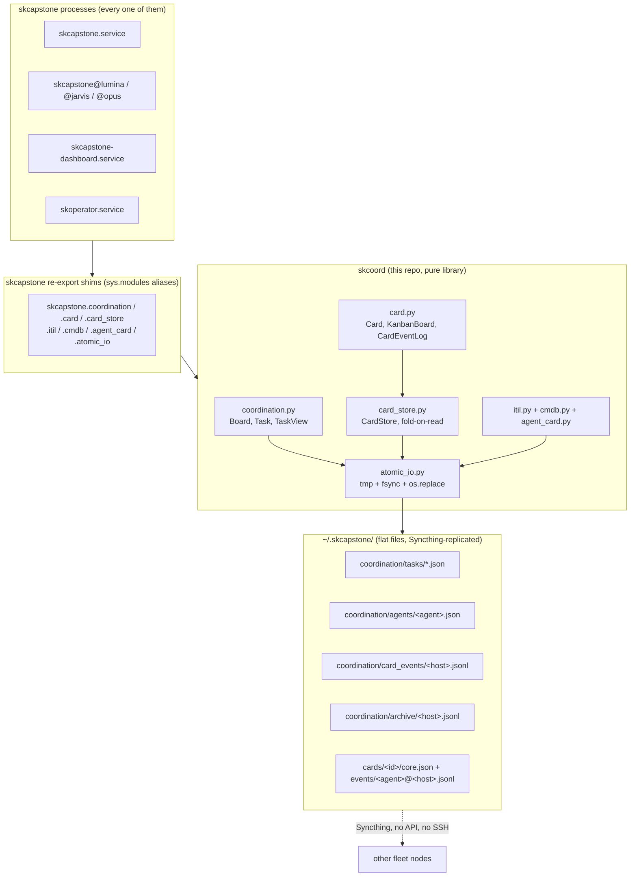

# skcoord - Standard Operating Procedures

`skcoord` is the sovereign coordination core: the conflict-free multi-agent task
board, the unified kanban Card model, the event-sourced CardStore, ITIL service
management, and the CMDB. It is a **pure Python library** with one runtime
dependency (`pydantic`). It ships no CLI and opens no socket. Its caller is
`skcapstone`, which declares `skcoord>=0.1.0` as a hard dependency and re-exports
these modules, so every skcapstone process executes skcoord code.

**Maturity-tier:** T0 - N/A (no key material, no crypto surface).
**Canonical-home for coordination storage semantics:** this file plus `SECURITY.md`.

---

## 1. Overview

### What it owns

- **The conflict-free task board.** `Board` + `Task` over
  `~/.skcapstone/coordination/`, where each agent writes only its own files and
  Syncthing propagates the rest (`src/skcoord/coordination.py:1-13`,
  `:144-166`).
- **The unified kanban Card model.** A read-only projection of coord tasks plus
  ITIL tickets onto one 5-column lifecycle, with a per-writer append-only overlay
  log (`src/skcoord/card.py`).
- **The event-sourced CardStore.** One work item is one directory
  `~/.skcapstone/cards/<id>/` holding a write-once `core.json` plus append-only
  per-writer event logs; current state is folded on read, never stored
  (`src/skcoord/card_store.py:1-12`, `:190-199`).
- **ITIL service management.** Incident, problem, change, CAB, KEDB
  (`src/skcoord/itil.py`).
- **The CMDB.** Event-sourced configuration items and relationships
  (`src/skcoord/cmdb.py`).
- **The agent identity vCard.** The shareable sovereign card for the mesh
  (`src/skcoord/agent_card.py`).
- **Crash-safe writes.** `atomic_write_text` (temp file, fsync, `os.replace`) is
  the only way any of the above touches disk (`src/skcoord/atomic_io.py`).

### What it explicitly does NOT do

- **No CLI, no daemon, no service.** There is no `[project.scripts]` in
  `pyproject.toml`, no `src/skcoord/__main__.py`, and no systemd unit in this
  repo. The user-facing commands (`skcapstone coord ...`) live in `skcapstone`.
- **No network.** Nothing imports `requests`, `urllib`, `httpx`, or `aiohttp`.
  `socket` is imported solely for `socket.gethostname()`, used to name per-writer
  files. It never opens a connection.
- **No credentials, no crypto.** See `SECURITY.md`. Card `meta` replicates across
  the fleet in cleartext, so a credential must never be put on a card.
- **No general-purpose CRDT.** The board is conflict-free for the write patterns
  it defines (per-agent files, per-writer append-only logs, atomic raw-dict card
  writes). It offers no guarantee under concurrent writers to the same card from
  multiple nodes.
- **No back-reference to `skcapstone` at import time.** The dependency is one way
  and is pinned by a test (see §4).

---

## 2. Architecture



**Dependency direction is one way: `skcapstone` depends on `skcoord`.** The few
reverse edges into skcapstone internals (`skjoule`, `active_agent_name`,
`gtd_tools`, `pubsub`, `activity`) are runtime-lazy inside the methods that use
them, so there is no import-time cycle. In skcapstone, `skcapstone.coordination`
and its six siblings are transparent `sys.modules` aliases of the skcoord
modules, so existing importers, attribute access, and `monkeypatch.setattr` all
reach this code byte-identically.

### Start here

| File | Why it is an entry point |
|---|---|
| `src/skcoord/coordination.py` | `Board` and `Task`. The board root, the directory layout, and `get_task_views()`, where status is derived rather than stored. |
| `src/skcoord/card.py` | `Card`, `Column`, `KanbanBoard`, `CardEventLog`, `fold_overlay`. The read-only projection every dashboard renders, and the overlay that can override a card's column. |
| `src/skcoord/card_store.py` | `CardStore` plus `card_store_read_enabled()` / `card_store_write_enabled()`. The event-sourced substrate and the `SKCOORD_CARD_STORE` switch that decides which store answers a read. |
| `src/skcoord/itil.py` | `ITILManager`. Incident, problem, change, CAB voting, KEDB, all on the same append-only per-writer pattern. |
| `src/skcoord/atomic_io.py` | 54 lines explaining why no write here is ever torn. Read it before adding any new write path. |

---

## 3. Build

Pure Python, `setuptools` + `setuptools_scm`, no compiled extension.

```bash
# development install into the fleet venv
~/.skenv/bin/pip install -e .

# distribution artifacts
python -m pip install --upgrade build twine
python -m build
python -m twine check dist/*
```

Requires Python >= 3.10. The only runtime dependency is `pydantic>=2.0,<3.0`.

**The version is never written into a file.** `pyproject.toml` declares
`dynamic = ["version"]` and derives it with `setuptools_scm` from the git tag,
restricted to release tags by
`tag_regex = "^v(?P<version>[0-9]+\.[0-9]+\.[0-9]+)$"` and a matching
`git_describe_command`. That restriction is deliberate: these repos also carry
non-semver tags (`swarm-20260717`, `fixwave-20260723`, and similar), and
setuptools-scm defaults to the newest tag of any shape, which once derived a
nonsense version elsewhere in the fleet. Any checkout that builds this package
therefore needs `fetch-depth: 0` and `fetch-tags: true`, or the build produces a
dev version.

---

## 4. Test (the green-bar gate)

```bash
~/.skenv/bin/python -m pytest tests/ -q     # 71 tests
~/.skenv/bin/python -m ruff check src/ tests/
```

`.github/workflows/ci.yml` is the blocking gate on push and pull request to
`main` / `master`, with three jobs and no `|| true` anywhere:

| Job | Command | Notes |
|---|---|---|
| `lint` | `ruff check src/ tests/` | Blocking. This repo is ruff-clean. |
| `test` | `python -m pytest tests/ -q` | Matrix on Python 3.10 and 3.12, in a clean venv created by `pip install -e . pytest`. |
| `build` | `python -m build` then `python -m twine check dist/*` | Catches a package that would be rejected at upload. |

The suite is **hermetic**: 7 files, every test takes `tmp_path` for its home, and
nothing reaches the network or a live host. `tests/test_smoke.py` is the
structural guard, in particular
`test_imports_do_not_pull_skcapstone`, which asserts that importing skcoord
leaves no `skcapstone*` module in `sys.modules`. That single test is what keeps
the one-way dependency honest; if it goes red, the extraction has regressed.

The remaining 6 suites are behavioural and cover the change-management fold
(`test_change_management.py`), the kanban column mapping
(`test_cm_p2_kanban.py`), the post-implementation-review fold
(`test_cm_p33_pir_fold.py`), cross-run failure memory (`test_failure_memory.py`),
the `describe` event (`test_spe_describe_event.py`), and the staged lane
(`test_staged_lane.py`). The exhaustive legacy behavioural suite still lives in
`skcapstone/tests` and exercises these same modules through the alias shims.

---

## 5. Release / Deploy

### 2026-08-21 CMDB source validation

Card `3799733b` revalidated the canonical CMDB, discovery, reconciliation, and
projection modules against GitHub `main`. Release evidence is the full pytest/Ruff/
build gate in section 4 plus the consumer integration suites in `skcapstone` and
`skdashboard`. Fleet consumers update this library only from a tagged GitHub release
(normally the matching PyPI artifact) and reinstall it into `~/.skenv`; the dashboard
process must then be restarted because it imports `skcoord` in-process.

CMDB library releases never mutate the live store or schedule by themselves.
The governed network rollout, authenticated CAB evidence, three-shadow gate,
timer cutover, and rollback sequence are maintained in
[`docs/cmdb-reconcile-rollout.md`](docs/cmdb-reconcile-rollout.md). The legacy
local apply unit and the ATLAS network apply unit are deliberately different
contracts; substituting one for the other is a release blocker.

This is a library and has no standalone service. Deploying it means reinstalling the
consumer environment and restarting only the long-running consumers that imported it.
A release is a PyPI publish, and consumers pick it up on their next install.

**Do not push a tag by hand.** `.github/workflows/publish.yml` cuts the tag
itself on a push to `main`:

1. The `tag` job ranks every `v[0-9]*.[0-9]*.[0-9]*` tag with `sort -V`, takes the
   highest, and cuts the next patch tag at HEAD. It uses the highest tag rather
   than `git describe` on purpose: `describe` only sees tags that are ancestors of
   HEAD, and an orphaned tag once made it restart the sequence at `v0.0.1`, below
   an already-published release. It is a no-op if HEAD already carries a release
   tag.
2. The `build` job refuses to publish a tag that is not an ancestor of
   `origin/main` (override: repository variable `ALLOW_OFF_MAIN_RELEASE=1`), then
   asserts the computed version is not a dev/local/`0.0.0` version before
   building, because PyPI would reject that with a 400 after the tag was already
   cut.
3. `pypi-publish` uploads in that same workflow run with Trusted Publishing (OIDC,
   environment `pypi`, no token). GitHub does not start a second workflow when the
   preceding job pushes the tag with `GITHUB_TOKEN`; waiting for a tag-push run is the
   failure that left tags `v0.1.9` through `v0.1.15` absent from PyPI.

Both `build` and `pypi-publish` carry `always() && !cancelled()` guards. That is
not decoration: a GitHub skip propagates through the job graph, so a bare
`needs:` on a skipped upstream job silently skips the publish. The publish job is
gated on the successful build, not on a second event that GitHub will not emit.

Rollback for a library is **forward only**: yank or supersede on PyPI and cut a
new patch. Consumers pin with `skcoord>=X.Y.Z`.

### Front-end / Exposure

**N/A - no network surface.** skcoord binds no address, serves no route, and has
no public `:443` presence. It opens no socket at all; `socket` is imported only
for `gethostname()`. Anything user-facing that reaches this code does so inside a
skcapstone process (the dashboard, the MCP tools, the `skcapstone coord` CLI), and
that process owns the exposure question, not this repo.

---

## 6. Configuration / Usage

There is no config file. Configuration is two things: the home path you pass in,
and one environment variable.

### Home path

Every manager takes the **shared** skcapstone root, not a per-agent home, so all
agents see one board:

```python
from pathlib import Path
from skcoord.coordination import Board, Task

board = Board(Path("~/.skcapstone").expanduser())
board.ensure_dirs()

board.create_task(Task(title="ship the thing", priority="high", created_by="lumina"))
views = board.get_task_views()          # tasks with DERIVED status
board.claim_task("lumina", "abc12345")  # writes agents/lumina.json only
board.complete_task("lumina", "abc12345")
```

Layout created under that root:

| Path | Writer | Contents |
|---|---|---|
| `coordination/tasks/<id>-<slug>.json` | the creator, once | The task spec. No status field. |
| `coordination/agents/<agent>.json` | that agent only | Claims, completions, current task, capabilities. |
| `coordination/card_events/<host>.jsonl` | that host, append-only | Kanban overlay events (move, assign, label, link, describe). |
| `coordination/archive/<host>.jsonl` | that host, append-only | Archive index. Task files are never mutated to archive them. |
| `cards/<id>/core.json` | the creator, write-once via `O_EXCL` | CardStore birth facts. |
| `cards/<id>/events/<agent>@<host>.jsonl` | that writer, append-only | CardStore events, folded on read. |

Note that the CardStore lives at `<home>/cards/`, a **sibling** of
`<home>/coordination/`, not inside it.

### `SKCOORD_CARD_STORE`

The one environment variable, read in `src/skcoord/card_store.py:505-529`.

**It is default-ON, not opt-in.** Post Phase-4e the store serves reads and takes
mirrored writes unless you explicitly disable it. The variable is a kill switch,
not a feature flag:

| Value | `card_store_write_enabled()` | `card_store_read_enabled()` | Meaning |
|---|---|---|---|
| unset, `1`, anything else | True | True | Default. The event-sourced store is the read source; legacy files keep being written as a hot backup. |
| `dual` | True | False | Bake mode: write both stores, read legacy. |
| `0`, `off`, `false`, `no` | False | False | Rollback. Legacy projection only. |

Both read paths carry a **catastrophe guard**: if the store returns nothing but
legacy task files exist on disk, the code logs a warning and serves the legacy
projection instead of an empty board (`coordination.py:656-666`,
`card.py:418-429`).

### WIP limits

`WIP_LIMITS = {"ready": 8, "doing": 6, "review": 4}` (`card.py:390`). The
expedite swimlane bypasses them.

---

## 7. API / Reference

### No self-report surface

**skcoord has no `health`, `doctor`, or `status` function, no `__main__`, and no
console script.** Do not look for one; there is nothing to run. Its self-report is
the test suite (§4). The nearest thing to a liveness check is:

```bash
python -c "import skcoord; print(skcoord.__all__)"
python -c "import importlib.metadata as m; print(m.version('skcoord'))"
```

The user-facing status commands (`skcapstone coord status`, `coord kanban`,
`coord briefing`) are skcapstone's, and the protocol text those commands print is
generated here by `get_briefing_text(home)` / `get_briefing_json(home)`
(`coordination.py:1111+`).

### Exported from the package root

`from skcoord import ...` resolves the names in `__all__`
(`src/skcoord/__init__.py:42-62`):

`AgentCapability`, `AgentCard`, `AgentFile`, `AgentState`, `Board`, `Card`,
`CardEvent`, `CardEventLog`, `Column`, `KanbanBoard`, `Kind`, `Task`,
`TaskPriority`, `TaskStatus`, `TaskView`, `atomic_write_text`,
`get_briefing_json`, `get_briefing_text`, `render_html`.

### Not re-exported: import from the submodule

| Symbol | Module | Purpose |
|---|---|---|
| `ITILManager` | `skcoord.itil` | Incidents, problems, changes, CAB decisions, KEDB. |
| `CMDBManager`, `ConfigItem`, `make_ci_id` | `skcoord.cmdb` | Configuration items and relationships. |
| `CardStore`, `card_store_read_enabled`, `card_store_write_enabled`, `task_views_from_store` | `skcoord.card_store` | The event-sourced substrate and its switch. |
| `fold_overlay`, `card_from_taskview`, `card_from_incident`, `card_from_problem`, `card_from_change` | `skcoord.card` | The projection functions. |

### Core model shapes

| Model | Module | Key point |
|---|---|---|
| `Task` | `coordination.py:96` | `id`, `title`, `description`, `priority`, `tags`, `created_by`, `created_at`, `acceptance_criteria`, `dependencies`, `notes`, `meta`. **There is no `status` field**, by design. |
| `AgentFile` | `coordination.py:117` | `agent`, `last_seen`, `host`, `state`, `current_task`, `claimed_tasks`, `completed_tasks`, `capabilities`, `itil_claims`, `notes`. |
| `TaskView` | `coordination.py:137` | `task` + a **derived** `status` + `claimed_by`. |
| `Column` | `card.py:40` | `backlog`, `ready`, `doing`, `review`, `done`. |
| `CardEvent` | `card.py` | Overlay actions: `move`, `set_priority`, `set_swimlane`, `add_label`, `remove_label`, `link`, `assign`, `unassign`, `describe`. Folded in `(ts, writer, seq)` order, last write wins. |

Every field added to these models must be **additive and optional**: older fleet
nodes read the same files and must tolerate a field they have never heard of.

---

## 8. Troubleshooting

| Symptom | Check |
|---|---|
| A task's status looks wrong, stale, or missing | `coordination/tasks/*.json` has **no `status` key at all** (`Task`, `coordination.py:96-114`). Status is always derived. Which derivation runs depends on `SKCOORD_CARD_STORE`: by default the CardStore fold under `cards/<id>/events/*.jsonl` answers (`coordination.py:648-665`); with the store disabled, `_legacy_task_views` derives it from the claim/complete lists in `agents/<agent>.json` (`coordination.py:670-711`). Grepping a task file for a status is discovery, not truth. |
| `agents/<agent>.json` disagrees with the board | Expected under the default read path. That file is the **legacy** derivation input. It is still authoritative for destructive maintenance (archival and aging deliberately use `_legacy_task_views`, because a claim recorded only in the legacy file must never be missed by a sweep), but a card moved through the store or the overlay will not be reflected in it. |
| Kanban column disagrees with the coord status | The overlay. `KanbanBoard.cards()` folds `coordination/card_events/*.jsonl` on top of the projection and overwrites `status`, `order`, `priority`, `swimlane`, labels, links, and owner (`card.py:452-470`). A manual move exists only in that log. |
| The board suddenly renders empty | The catastrophe guard fired or should have. Look for `CardStore returned no tasks but legacy files exist` or `CardStore empty but legacy task files exist` in the logs. If the store is behind, set `SKCOORD_CARD_STORE=0` to pin the legacy projection while you investigate. |
| A JSON file fails to parse after a crash or a Syncthing sync | Some write path bypassed `atomic_write_text`. Every write must go through it (tmp file, fsync, `os.replace`); a plain `path.write_text` truncates in place and leaves a torn file. Malformed archive index lines are skipped with a warning rather than aborting the read (`coordination.py:186-188`). |
| A task update silently dropped a `meta` key | Mutations must load the **raw dict**, not the `Task` model, so unmodelled keys such as `meta.autopilot` survive. `_write_task_raw` is the path that does this. |
| `test_imports_do_not_pull_skcapstone` fails | Something added an import-time reference back into skcapstone. Move it inside the method that needs it (the existing reverse edges to `skjoule`, `active_agent_name`, `gtd_tools`, `pubsub`, `activity` are all runtime-lazy for exactly this reason). |
| `skcoord.__version__` does not match `pip show skcoord` | `__version__` in `src/skcoord/__init__.py` is a **static literal** and does not track the git tag. The authoritative version is the installed distribution metadata: `python -c "import importlib.metadata as m; print(m.version('skcoord'))"`. See §9. |
| A build produces a `.devN` or `+g<sha>` version | The checkout has no tags. Every `actions/checkout` here sets `fetch-depth: 0` and `fetch-tags: true`; a local clone needs `git fetch --tags`. |
| A tag was cut but nothing appeared on PyPI | Check whether `pypi-publish` was **skipped** rather than failed. A skip propagates through the job graph, which is why both downstream jobs carry `always() && !cancelled()`. Verify on PyPI, not on the green run. |
| `Task ... already claimed` on claim | `claim_task` refuses a task already in `DONE`, `CLAIMED`, or `IN_PROGRESS` (`coordination.py:821-825`). Read the board before writing. |

---

## 9. Maturity-tier + Version reference

### Stated maturity tier: **T0 - N/A (no key material)**

| Axis | skcoord state | Evidence |
|---|---|---|
| **T0 Classical** | **N/A.** This repo performs no cryptographic operation, holds no key, and stores no secret. | No crypto import anywhere in `src/skcoord/`; `SECURITY.md` "Secret handling". |
| **T1 Agile** | N/A, no crypto surface to make agile. | |
| **T2 Hybrid KEM** | N/A, no key exchange, no encryption at rest. Card `meta` replicates in cleartext by design, which is why a credential must never be placed on a card. | `SECURITY.md` threat model. |
| **T3 Hybrid signature** | N/A, skcoord signs nothing. Provenance signing (SPE) is applied by the layer above. | |
| **T4 Transport closed** | **N/A, no transport leg.** No socket is opened. Replication is Syncthing's, and Syncthing owns that transport's security properties. | Nothing imports a network client; `urllib.parse.quote` only escapes injected Proxmox adapter paths, and `socket` is used only for `gethostname()`. |

**Honest tier statement:** skcoord is a **non-crypto** library. It is the
integrity boundary for task state, not a confidentiality boundary. It makes no
post-quantum claim of any kind, because it has no surface on which such a claim
could be scoped. The security properties that matter here are crash-safety
(atomic writes), single-writer file ownership, and additive schema evolution, all
of which are testable and covered above.

### Version

- **Source of truth:** the git tag, via `setuptools_scm`. There is no version
  string in `pyproject.toml`; it declares `dynamic = ["version"]`. A release is
  cut automatically by `publish.yml` on a push to `main` (§5).
- **How to read the installed version:**
  `python -c "import importlib.metadata as m; print(m.version('skcoord'))"`.
- **Known drift:** `src/skcoord/__init__.py` also defines a hardcoded
  `__version__` literal. It is **not** wired to setuptools-scm and does not track
  the tag, so it can disagree with the distribution metadata. Treat the
  distribution metadata as authoritative. `SECURITY.md` already states that a
  hardcoded version must not be added; removing this leftover is a follow-up code
  change, deliberately out of scope for a docs-only pass.
- **VERSION_LIFECYCLE phase:** Shared library, extracted from `skcapstone` under
  CR-4.1. Pre-1.0. No `1.0` until the behavioural suite that still lives in
  `skcapstone/tests` has a home here or a parity guarantee.
- **Public API stability:** the names in `skcoord.__all__` are what `skcapstone`
  re-exports. Changing one is a breaking change for every fleet node, because the
  shims make them the same objects.

### Honest-claims line

Every claim in this SOP is scoped to a surface and carries its verifier: a
`file:line`, a test name, a CI job, or a documented command. The "no network
surface", "no CLI", and "no secrets" claims are each checkable by the evidence
block below. No capability is asserted that this repo does not implement.

---

<!-- docs-evidence
verified: 2026-08-21
checks:
  - name: board root layout matches section 6
    run: grep -q 'self.coord_dir = self.home / "coordination"' src/skcoord/coordination.py && grep -q 'self.tasks_dir = self.coord_dir / "tasks"' src/skcoord/coordination.py && grep -q 'self.agents_dir = self.coord_dir / "agents"' src/skcoord/coordination.py
  - name: CardStore root is the cards/ sibling, not inside coordination/
    run: grep -q 'self.cards_dir = self.home / "cards"' src/skcoord/card_store.py
  - name: SKCOORD_CARD_STORE is a default-ON kill switch
    run: grep -q '_CARD_STORE_DISABLED = {"0", "off", "false", "no"}' src/skcoord/card_store.py
  - name: Task carries no status field (status is derived)
    run: python3 -c "import ast,sys;t=[n for n in ast.parse(open('src/skcoord/coordination.py').read()).body if isinstance(n,ast.ClassDef) and n.name=='Task'][0];f=[x.target.id for x in t.body if isinstance(x,ast.AnnAssign)];sys.exit(1 if 'status' in f else 0)"
  - name: pure library, no console script and no __main__
    run: test ! -e src/skcoord/__main__.py && ! grep -q 'project.scripts' pyproject.toml
  - name: no network surface (sockets are never opened)
    run: ! grep -rqE '^\s*(import|from)\s+(requests|httpx|aiohttp|http\.client)' src/skcoord/ && ! grep -rqE '^\s*from\s+urllib\.(request|error)' src/skcoord/ && ! grep -rq 'socket.socket' src/skcoord/
  - name: version stays setuptools-scm derived from a v-semver tag
    run: grep -q 'dynamic = \["version"\]' pyproject.toml && grep -q 'tag_regex' pyproject.toml && ! grep -qE '^version[[:space:]]*=' pyproject.toml
  - name: documented WIP limits match the code
    run: grep -q 'WIP_LIMITS = {"ready": 8, "doing": 6, "review": 4}' src/skcoord/card.py
  - name: section 4 test gate matches what CI actually runs and cannot be softened
    run: grep -qE 'run: python -m pytest tests/ -q[[:space:]]*$' .github/workflows/ci.yml && grep -qE 'run: ruff check src/ tests/[[:space:]]*$' .github/workflows/ci.yml && ! grep -q '|| true' .github/workflows/ci.yml
  - name: the one-way dependency guard test still exists
    run: grep -q 'def test_imports_do_not_pull_skcapstone' tests/test_smoke.py
  - name: auto-tagged releases publish in the same workflow run
    run: python3 -m pytest tests/test_publish_workflow.py -q
-->
